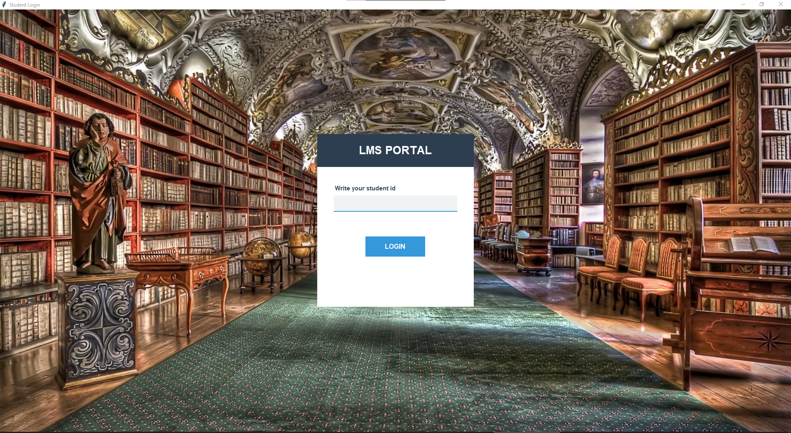
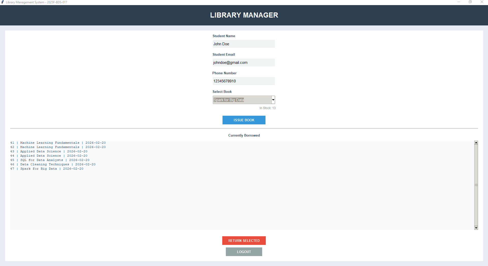

# Library Management System (Python)

A modular desktop-based Library Management System built using Python, Tkinter, and SQLite. The application allows students to issue and return books while maintaining a structured and persistent database record.

---

## Project Overview

This system is designed to simulate a real-world academic library workflow. It demonstrates backend database integration, input validation, and modular application design.

The project focuses on:

- Structured GUI development using Tkinter
- SQLite database management
- Input validation using Regular Expressions
- Modular file organization
- Inventory tracking and CRUD operations

---

## Key Features

- Student ID validation using Regex (e.g., 2025F-BDS-017 format)
- Real-time inventory updates when books are issued or returned
- Persistent storage using SQLite
- Modular architecture separating UI, logic, and database operations
- Clean and responsive desktop interface using Tkinter and Pillow

---

## Tech Stack

- Python
- Tkinter (GUI)
- SQLite
- Pillow (Image Handling)
- Regular Expressions (Regex)

---

## Project Structure

```
Library-Management-System-Python/
│
├── main.py
├── lmsPage.py
├── database.py
├── books.py
├── background.jpg
├── .gitignore
└── README.md
```

- `main.py` → Entry point and login validation
- `lmsPage.py` → Core issuing & returning logic
- `database.py` → Database connection and CRUD operations
- `books.py` → Static data source for available books

---

## Interface Preview




---

## Installation & Usage

1. Clone the repository:
```bash
git clone https://github.com/your-username/Library-Management-System-Python.git
```

2. Install dependencies:
```bash
pip install Pillow
```

3. Run the application:
```bash
python main.py
```

---

## Purpose of This Project

This project demonstrates my ability to:

- Design modular Python applications
- Integrate relational databases
- Implement validation logic
- Build functional desktop interfaces

It reflects my growing interest in building structured, data-driven systems.

---

## Developer

Muhammad Bazil  
